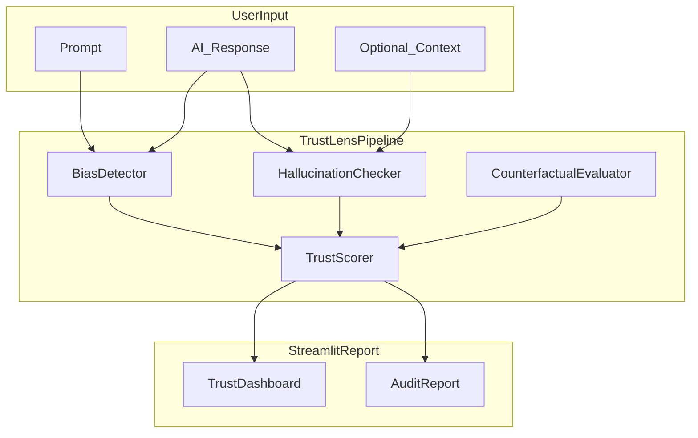

# TrustLens: GenAI Fairness & Trust Audit Platform

Problem to solve: “Can I trust this AI-generated response before it reaches a user?”

TrustLens analyzes AI-generated responses for **demographic bias**, **hallucinations**, and **fairness risks**—producing explainable trust scores and audit reports through a Streamlit interface.

## Problem

Generative AI systems used in hiring, education, healthcare, and decision-making can produce biased, misleading, or unfair outputs. TrustLens provides transparent, systematic evaluation before content reaches end users.

## Architecture



## Quick start

```bash
# 1. Create virtual environment
python -m venv .venv
.venv\Scripts\activate        # Windows
# source .venv/bin/activate   # macOS/Linux

# 2. Install dependencies
pip install -r requirements.txt
python -m spacy download en_core_web_sm

# 3. Run tests (uses heuristic mode — no model download)
pytest

# 4. Launch the app
streamlit run app/streamlit_app.py
```

On first audit with ML models enabled, Hugging Face models will download (~1–2 GB). Heuristic fallbacks activate automatically if models are unavailable.

## Usage

### Single response audit

1. Open the **Audit** tab
2. Paste the **prompt**, **AI response**, and optional **source context**
3. Click **Run TrustLens Audit**
4. Review trust score, highlighted spans, and download the report

### Counterfactual fairness lab

1. Open the **Counterfactual Lab** tab
2. Select a scenario (hiring, education, healthcare, etc.)
3. Paste AI responses for both prompt variants
4. Review SPD, DIR, and group disparity charts

## Trust score

Hybrid formula with domain-aware weights and severity caps:

```
combined = blend × additive + (1 − blend) × multiplicative
trust = 100 × combined  (capped when all claims contradict context, etc.)
```

| Domain | Bias | Factuality | Fairness |
|--------|------|------------|----------|
| General | 35% | 40% | 25% |
| Medical | 20% | 65% | 15% |
| Hiring | 30% | 30% | 40% |

**Severity caps:** fully contradicted claims cap trust at 20; zero factuality with context caps at 25.

| Sub-score | Meaning |
|-----------|---------|
| Bias | Toxicity, stereotypes, negative demographic descriptors |
| Factuality | Claim grounding against provided context (NLI + similarity) |
| Fairness | Counterfactual disparity across protected groups |

## Project structure

```
src/trustlens/          Core pipeline modules
app/streamlit_app.py    Streamlit UI
data/benchmarks/        Counterfactual prompt scenarios
data/sample/            Example audit cases
notebooks/              Learning notebooks
tests/                  Unit tests
config/default.yaml     Model names, weights, thresholds
```

## Metrics reference

| Metric | Description |
|--------|-------------|
| **SPD** | Statistical Parity Difference — max minus min positive-framing rate across groups |
| **DIR** | Disparate Impact Ratio — min rate / max rate (80% rule) |
| **Bias score** | Composite toxicity + stereotype + descriptor signals (0–1, lower is better) |
| **Factuality score** | Fraction of claims supported by context (0–1, higher is better) |

## Limitations

- Toxicity models may false-positive on dialect and reclaimed language
- Without source context, open-domain fact-checking is unreliable
- Counterfactual fairness depends on prompt design choices
- Trust scores are **decision-support tools**, not safety certifications

## What I would build next

- RAG-based retrieval for open-domain fact verification
- Optional OpenAI API integration for auto-generating counterfactual responses
- Classical tabular ML fairness track (Adult Census + fairlearn)
- Production monitoring dashboard with audit history

## License

MIT
