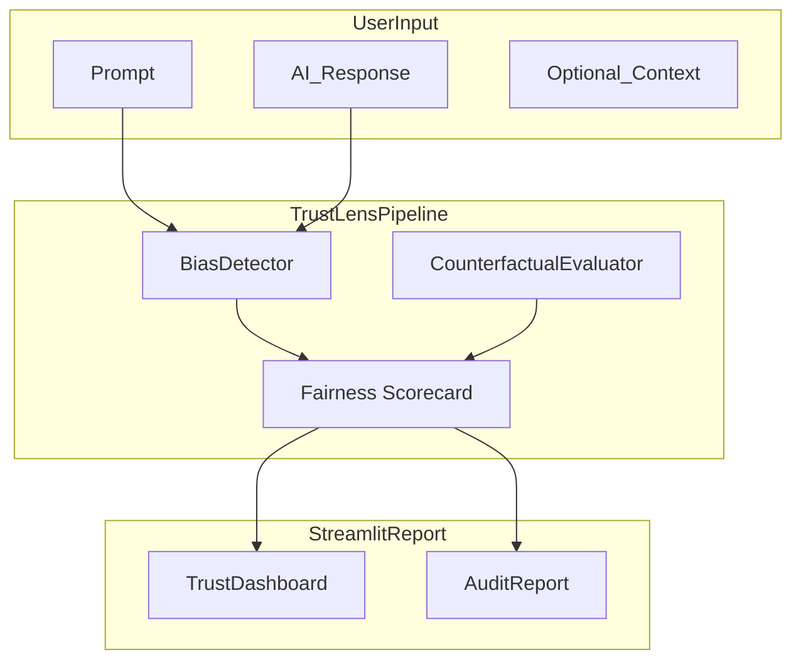

# TrustLens — User & Developer Guide

## 1. Project Overview

TrustLens is a tabular fairness auditing platform that helps teams answer: “Can this predictive model make fair decisions across demographic groups?”

- Purpose: identify, quantify, and document demographic disparities in binary classifiers trained on tabular data; compare mitigation strategies; produce explainable, audit-ready reports.
- Primary workflows: dataset profiling → model training → fairness evaluation → mitigation → explainability → PDF audit.

## 2. Quick Start

```bash
# 1. Create virtual environment
python -m venv .venv
.venv\Scripts\activate        # Windows
# source .venv/bin/activate   # macOS/Linux

# 2. Install dependencies
pip install -r requirements.txt

# 3. Run tests
pytest

# 4. Launch the app
streamlit run app/streamlit_app.py
```

## 3. Architecture



Core files and entry points:
- `app/streamlit_app.py` — Streamlit UI (dashboard entry).
- `src/trustlens/pipeline.py` — central orchestration: load dataset, train, evaluate, mitigate, explain, report.
- `src/trustlens/models.py` — model registry and training wrappers.
- `src/trustlens/bias/` — dataset loaders, mitigation, detectors, experiment tracker.
- `src/trustlens/fairness/metrics.py` — fairness math and scoring.
- `src/trustlens/explain/shap_explainer.py` — SHAP explainability.
- `src/trustlens/io/` — visuals and PDF generator.

## 4. Dataset Layer

Supported dataset loaders implement dataset-specific preprocessing and provide consistent outputs: `X_train, X_test, y_train, y_test, sens_train, sens_test, feature_names`.

- Adult Census (Adult)
  - Protected attributes: `sex`, `race`, `age_group`.
  - Target: income (binary).
- IBM HR Analytics (IBM HR)
  - Protected attributes: `Gender`, `MaritalStatus`, `age_group`.
  - Target: Attrition.
- Synthetic Hiring (Hiring)
  - Protected attributes: `Gender`, `age_group`.

Loaders are implemented in `src/trustlens/bias/dataset_loader.py`.

## 5. End-to-End Workflow (UI → Pipeline)

1. UI: user selects dataset and protected attribute.
2. Loader: reads CSV or generates fallback, preprocesses features and splits.
3. Model training: `ModelRegistry` fits estimators (Logistic, RandomForest, XGBoost).
4. Evaluation: compute performance metrics and fairness metrics on test split.
5. Detection: `BiasDetector` flags disparities and severity.
6. Mitigation: apply Reweighing, Exponentiated Gradient, or Threshold Optimization.
7. Explainability: compute SHAP global and local explanations.
8. Reporting: save visuals (PNG) and assemble PDF (`audit_report_generator`).

## 6. Models and Training

- Logistic Regression — linear baseline, interpretable coefficients.
- Random Forest — non-linear baseline with robust performance.
- XGBoost — high-performance gradient boosting.

Preprocessing: numeric scaling using training mean/std; categorical one-hot encoding using categories from training; the protected attribute is handled separately for fairness measurement.

All training is wrapped by `src/trustlens/models.py`.

## 7. Fairness Metrics (formulas, intuition)

Notation: $A$ = protected attribute, groups $g\in G$, $\hat{Y}$ = predicted label, $Y$ = true label.

- Statistical Parity Difference (SPD):

$$
\text{SPD} = P(\hat{Y}=1 \mid A=\text{priv}) - P(\hat{Y}=1 \mid A=\text{unpriv})
$$

- Disparate Impact Ratio (DIR) — min / max selection rates:

$$
\text{DIR} = \frac{\min_g P(\hat{Y}=1 \mid A=g)}{\max_g P(\hat{Y}=1 \mid A=g)}
$$

(80% rule: DIR &ge; 0.8 is often used as a heuristic threshold.)

- Equal Opportunity Difference (EOD):

$$
\text{EOD} = TPR_{priv} - TPR_{unpriv} \quad \text{where } TPR_g = P(\hat{Y}=1 \mid Y=1, A=g)
$$

- Equalized Odds (scalar approximation):

$$
\text{EqOddsDiff} = \tfrac{1}{2}\left(|TPR_{priv}-TPR_{unpriv}| + |FPR_{priv}-FPR_{unpriv}|\right)
$$

Interpretation: values near zero indicate parity; thresholds depend on context (e.g., |SPD| &le; 0.1, DIR &ge; 0.8 are commonly used heuristics).

## 8. Bias Detection and Severity

- Compute SR, TPR, FPR per group on test set.
- Compare differences/ratios to thresholds.
- Severity rules (heuristic):
  - Low: within thresholds.
  - Moderate: borderline (e.g., DIR 0.6–0.8 or |SPD| 0.1–0.2).
  - Severe: DIR < 0.6 or |SPD| > 0.2.

Detector code lives in `src/trustlens/bias/detector.py` and metrics in `src/trustlens/fairness/metrics.py`.

## 9. Counterfactual Analysis

- Create variants of an instance by flipping protected attribute(s), keeping other features constant.
- Re-run model predictions; compute flip rates and report.
- High flip rate indicates counterfactual unfairness.

Counterfactual logic: `src/trustlens/fairness/counterfactual.py`.

## 10. Bias Mitigation Methods

- Reweighing (preprocessing): compute sample weights for (A,Y) combinations to balance distribution; train weighted learners.
- Exponentiated Gradient (Fairlearn, in-processing): constrained optimization to satisfy fairness definitions while optimizing accuracy.
- Threshold Optimization (post-processing): group-specific thresholds on predicted scores to equalize target metric (TPR, FPR).

Tradeoffs: each method has different transparency, theoretical guarantees, and accuracy impact. See `src/trustlens/bias/bias_mitigation.py`.

## 11. Fairness vs Accuracy Tradeoffs

- TrustLens produces tradeoff visualizations (accuracy vs fairness metric) and a leaderboard.
- Select models on the Pareto frontier balancing your policy needs.

## 12. Explainability (SHAP)

- Global: mean(|SHAP|) per feature to rank importance.
- Local: per-instance SHAP values to explain individual decisions.
- Implemented in `src/trustlens/explain/shap_explainer.py`.

## 13. Research Findings & Recommendation Engine

- Research findings: heuristics that turn experiment history into human-readable observations (e.g., "Mitigation X improved DIR from 0.62 → 0.85 with 2.5% accuracy loss").
- Recommendation engine: suggests mitigations when metrics exceed thresholds and ranks mitigations by fairness improvement vs accuracy cost.
- ExperimentTracker (leaderboard) persists historical runs.

## 14. PDF Audit Reports

- Generator: `src/trustlens/io/audit_report_generator.py`.
- Sections: metadata, certification badge, performance & fairness tables, leaderboards, tradeoff visuals, findings, recommendations.
- Important note: images must be real image files (PNG/JPG); HTML fallbacks are not embedded. The code now checks suffixes and handles missing visuals gracefully.

## 15. Example Walkthrough (illustrative)

- Dataset: Adult Census; protected attribute: Gender.
- Baseline Random Forest: accuracy 0.82, SR_Male 0.30, SR_Female 0.18 → SPD 0.12, DIR 0.60 → flagged.
- Reweighing retrain: accuracy 0.80, SPD 0.04, DIR 0.85 → mitigation effective with small accuracy drop.
- Produce PDF summarizing outcomes.

## 16. Interview Prep (short answers)

- How defined fairness: multiple metrics (SPD, DIR, EOD, Equalized Odds) to capture different concerns.
- Why multiple mitigations: they address problems at data, training, and post-hoc stages; selection depends on organizational constraints.
- Prevent metric gaming: use multiple metrics, split stability checks, and human review.

## 17. File Map & Key Links

- `src/trustlens/pipeline.py` — orchestration
- `src/trustlens/bias/dataset_loader.py` — datasets
- `src/trustlens/models.py` — training registry
- `src/trustlens/fairness/metrics.py` — metric math
- `src/trustlens/bias/bias_mitigation.py` — mitigations
- `src/trustlens/explain/shap_explainer.py` — SHAP
- `src/trustlens/io/visuals.py` — visual exports
- `src/trustlens/io/audit_report_generator.py` — PDF assembly
- `app/streamlit_app.py` — dashboard UI

## 18. Next Steps & Maintenance Tips

- Keep legacy experimental modules isolated and run the cleanup audit before deleting code.
- When adding new mitigations, add unit tests that validate both fairness metrics and no regression in core accuracy measures.
- For production reports, ensure a stable `kaleido`/image-export path so visuals are generated as PNGs.

---

Generated by the developer lead notes. For changes, review the file and request edits or a shorter cheat sheet.
